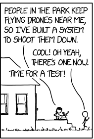

# monocle
`monocle` is a web app that takes an uploaded image, scans it for text, runs OCR on the text, and retains the sequence of conversation.

## Inspiration
This project came as a response to CBRE's challenge from the [2022 Texas A&M Datathon](https://tamudatathon.com/challenges/docs/cbre). The goal was to take an image like this: 

and read the text while keeping the sequence of conversation.

## What it does
Currently, `monocle` takes an image as an input, reads the text, and stores it in a list depending on the sequence of the conversation.

`flask` was used for the frontend. The user is able to upload and image `flask` passes this back to `CRAFT` for text detection and then to `tesseract` for OCR. 

`CRAFT` gets the coordinates of each word. These coordinates are then grouped together to predict sequences. `tesseract` reads each sequence individually for increased accuracy.
